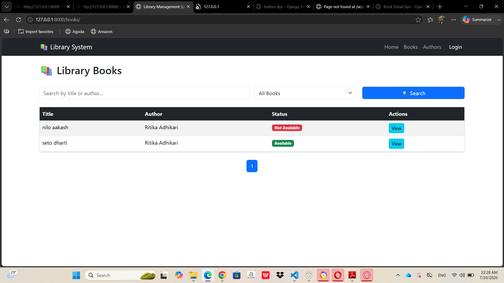
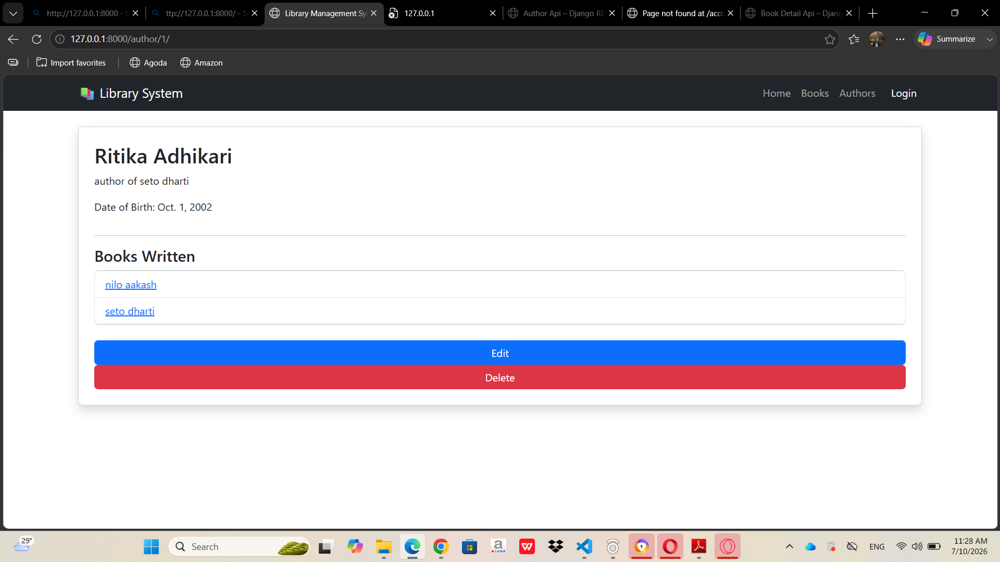
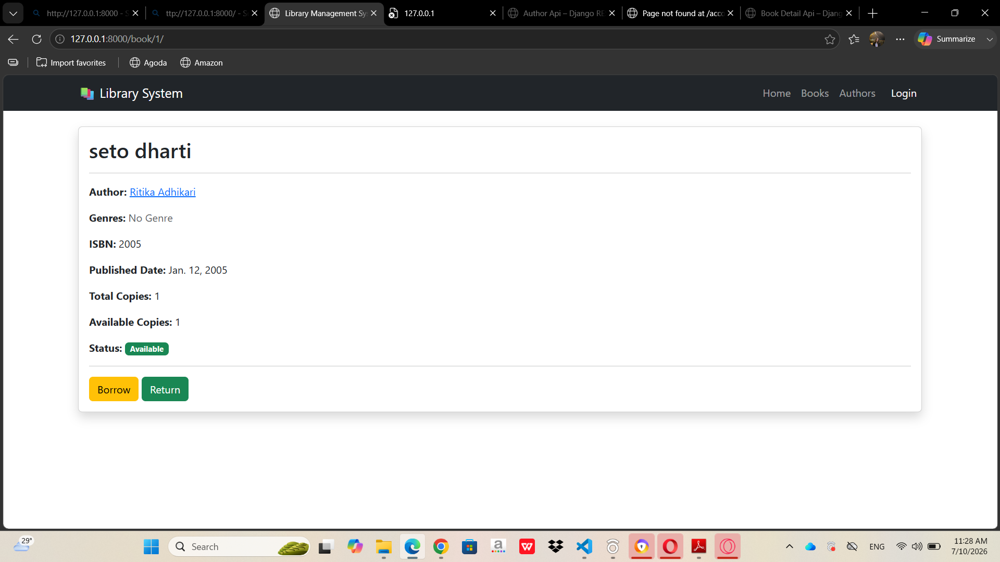
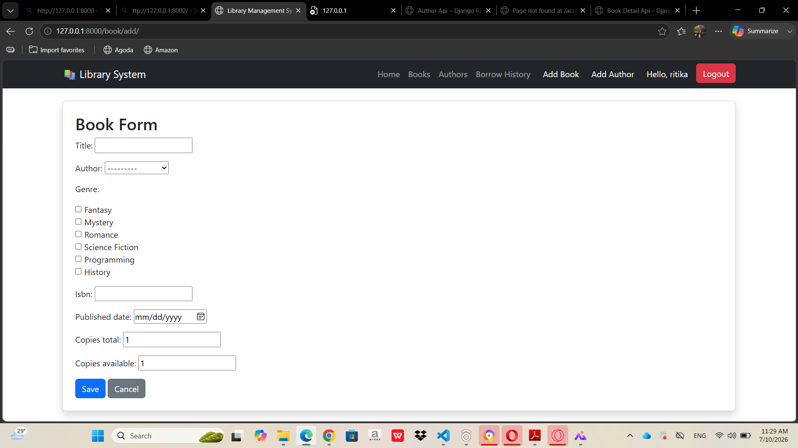

# Library Management System


## Project Description

The Library Management System is a Django-based web application developed to help manage books, authors, genres, and book availability efficiently.

The application allows users to manage books and authors through CRUD operations. Users can add, view, update, and delete books and authors. The system also provides book borrowing and returning functionality with automatic tracking of available copies and borrowing history.

The project follows Django's MVT (Model-View-Template) architecture and uses SQLite as the database.


---

# Setup and Installation Instructions


Follow the steps below to run this project locally.


## 1. Clone the Repository

```bash
git clone <your-github-link>
```


## 2. Navigate to the Project Folder

```bash
cd LibraryManagement
```


## 3. Create a Virtual Environment

```bash
python -m venv venv
```


## 4. Activate the Virtual Environment


For Windows:

```bash
venv\Scripts\activate
```


## 5. Install Required Dependencies

```bash
pip install -r requirements.txt
```


## 6. Apply Database Migrations

```bash
python manage.py migrate
```


## 7. Create Admin Account

Create a superuser account to access the Django admin panel:

```bash
python manage.py createsuperuser
```


## 8. Run the Development Server

```bash
python manage.py runserver
```


Open the application in your browser:

```
http://127.0.0.1:8000/
```


---

# Features Implemented


## Book Management

- Add new books
- View all books
- View detailed information about books
- Edit book details
- Delete books with confirmation
- Display author information
- Track total copies and available copies


## Author Management

- Add new authors
- View all authors
- View author details
- Edit author information
- Delete authors with confirmation
- Display books written by each author


## Genre Management

- Added a separate Genre model
- Implemented many-to-many relationship between books and genres
- Display genres associated with each book


## Book Availability System

- Borrow books
- Return books
- Automatically update available copies
- Prevent borrowing when no copies are available
- Prevent returning when all copies are already available
- Display book availability status:
  - Available
  - Not Available


## Search and Filtering

- Search books by title
- Search books by author name
- Filter books based on availability status


## Pagination

- Implemented pagination on the book list page
- Display books page by page for better user experience


## User Authentication

- User login system
- User logout system
- Restricted book and author modification features to authenticated users
- Protected borrowing, returning, and history features using Django authentication


## Borrowing History

- Store borrowing records
- Track which user borrowed which book
- Store borrowing date
- Store returned date
- Display user-specific borrowing history


## Django Admin

- Registered Book, Author, Genre, and BorrowHistory models
- Customized admin display
- Manage application data through Django admin dashboard


## REST API

Implemented Django REST Framework APIs for accessing application data.


### Book APIs

Get all books:

```
GET /api/books/
```


Get book details:

```
GET /api/books/<id>/
```


### Author APIs

Get all authors:

```
GET /api/authors/
```


Get author details:

```
GET /api/authors/<id>/
```


## User Interface

- Bootstrap-based responsive design
- Navigation bar for easy access
- Reusable templates using Django template inheritance
- User-friendly forms and tables
- Success and error notification messages


---

# Bonus Features Implemented


The following additional features were implemented:

- Search functionality
- Availability filtering
- Pagination
- User authentication
- Genre management
- Borrowing history tracking
- Django REST Framework API
- Customized Django Admin panel
- Improved navigation and user experience


---

# Screenshots


## 1. Book List Page




## 2. Author Detail Page






## 3. Add/Edit Book Form




---

# Technologies Used

- Python
- Django
- Django REST Framework
- SQLite
- HTML
- CSS
- Bootstrap


---

# Project Structure

```
LibraryManagement

│
├── manage.py
├── requirements.txt
├── README.md
│
├── screenshots
│   ├── book_list.png
│   ├── book_form.png
│   ├── img1.png
│   └── img2.png
│
├── app
│   ├── models.py
│   ├── views.py
│   ├── urls.py
│   ├── forms.py
│   └── serializers.py
│
└── library
    ├── settings.py
    └── urls.py
```


---
